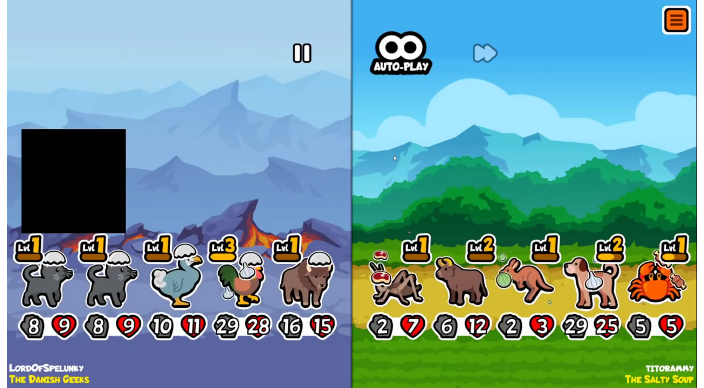
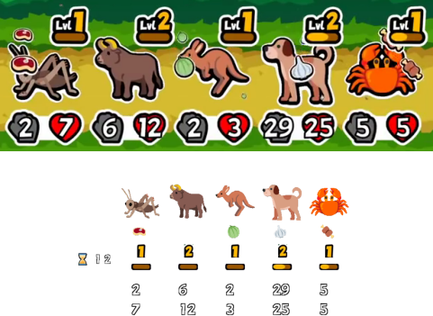

# SuperAutoPets Team Extractor

This repository contains code that extracts enemy teams in the [SuperAutoPets](https://store.steampowered.com/app/1714040/Super_Auto_Pets/) game from Youtube videos of streamer. \
The code only uses standard computer vision tools such as pattern matching (using opencv). \
For now, the script can only recognize pets from the main pack and from the first extension pack. \

## Requirements

- python3
  + numpy
  + matplotlib
  + opencv-python
  + (optional) [yt-dlp](https://github.com/yt-dlp/yt-dlp) to download Youtube video (with the `process_videos.py` script)
- inkscape (for the image downloader script, to convert SVG files to PNG)

## Usage

The extractor code also needs the pets and objects images of SuperAutoPets, which are based on emojis from three opensource repositories:
- [Twitter emojis](https://github.com/twitter/twemoji)
- [Google emojis](https://github.com/googlefonts/noto-emoji)
- [Mozilla emojis](https://github.com/mozilla/fxemoji)

In order to download the necessary images, clone the three emoji repositories in a directory (e.g. `emoji_dir`) and run the python script:
`python3 download_imgs.py path/to/emoji_dir/`. \
This will create a new directory `imgs/` containing images for all pets and status that the script use to recognize each element in enemy teams.

Once the images have been downloaded, run `python3 team_extractor.py path/to/video/` to start extracting every enemy team from a SuperAutoPets game video. \
The path can be a video or a directory, in which case the script will by default look for a file named `video.mp4` in the given directory. \
The script accepts several options:
- `-o` or `--output`: the directory in which to save the extracted teams. By default, the output directory is the base directory of the path given as argument.
- `-f` or `--nb_finders`: the number of processes that search for the first frame of every battle in the given video. The video is then split in `-f` equal parts, each one managed by one process.
- `-e` or `--nb_extractors`: the number of processes that actually extract teams from the frames found by the finders.
- `--sync`: force `-f 1 -e 1` and run without multiprocessing, mainly for debugging purpose or for slow computers.

In the output directory, the script will save two kinds of files:
- For each team, a `png` file with the frame of the video from which the team has been extracted, along with a visual summary of the information extracted from this frame in order to check easily if any mistake has been made.
- A file `team_list.txt` containing the summary of all the extracted teams. Each line of this file corresponds to a team, following the following format: \
  `turn_number (PetName1 Attack1 Life1 XP1 Status1) (PetName2 Attack2 Life2 XP2 Status2) ...` \
The XP value corresponds to the number of time the pet has been combined with another pet of the same type: so 0 corresponds to Lvl 1, 1 to Lvl 1+1/2, 2 to Lvl 2 etc.

The `process_videos.py` script can be used to process batch of videos successively. Given a video id, it first download it in the directory `checks/{video_id}/video.mp4` and then process it (i.e. extract every enemy team appearing in it). \
It takes a list of arguments, which can be of two kinds:
- Youtube video ids (i.e. 11 character long strings)
- paths to text files containing one video id per line

It also accepts the following options:
- `-f` or `--nb_finders`: same as for `team_extractor.py` (this option simply will be passed to the script).
- `-e` or `--nb_extractors`: same as for `team_extractor.py` (this option simply will be passed to the script).
- `-d` or `--nb_downloaders`: the number of Youtube videos to download in parallel (if the given video id can't be found in the directory `checks/{video_id}`).
- `--download_only`: only download videos without processing them, mainly for debugging purpose.

## Example

The following frame will be processed as follows:

Whole frame: 

Extracted team visual summary: \

Textual summary: \
`12 (cricket 2 7 0 steak_attack) (ox 6 12 2 none) (kangaroo 2 3 0 melon_armor) (dog 29 25 4 garlic_armor) (crab 5 5 1 bone_attack)`
